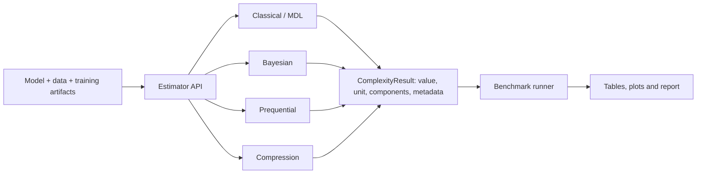

# DL Complexity

**Theoretically informed deep learning model complexity estimation** — библиотека и
экспериментальный стенд для сопоставимой оценки сложности моделей глубокого обучения.

> Статус: этап планирования. Код учебного шаблона удалён; перечисленные ниже методы и
> чистый пакет `dl_complexity` ещё предстоит реализовать.

## Идея и задача

Число параметров плохо объясняет, почему сильно перепараметризованные нейросети способны
обобщать. Проект рассматривает сложность как стоимость описания модели и данных либо как
приближение байесовского evidence. Его задача — реализовать несколько теоретически
обоснованных оценок под единым интерфейсом и проверить, какие из них лучше предсказывают
качество обобщения нейросетей.

Основной исследовательский вопрос: **насколько значение и ранжирование оценок сложности
согласуются с test NLL, generalization gap и устойчивостью модели при изменении размера
выборки, архитектуры и регуляризации?**

Все кодовые длины должны возвращаться в `nats` и/или `bits`, а также в нормированном виде
на один объект. Вместе с числом метод обязан сохранять допущения, составляющие оценки,
время вычисления и конфигурацию эксперимента. AIC/BIC-подобные критерии нельзя считать
универсальной «истинной сложностью» нейросети: проект сравнивает приближения и явно
указывает область применимости каждого из них.

## Методы и ответственные

| Ветка | Методы | Ответственный |
| --- | --- | --- |
| Классические и базовые MDL | AIC, BIC, HQIC, WAIC, WBIC, 2-part MDL | Алябушев |
| Байесовские коды | variational coding; KFAC-Laplace approximation of evidence; связь с MDL | Дементьев |
| Последовательные коды | blockwise prequential coding, online/replay-варианты, калибровка | Курдюков |
| Компрессионные оценки | pruning, low-rank/quantization и compression-based generalization bound | Чирков |

Граница ответственности включает формулу и допущения метода, реализацию общего
интерфейса, минимальный воспроизводимый пример и unit-тесты своей ветки. Сложные методы
сначала реализуются для небольших MLP/CNN; масштабирование не должно задерживать PoC.

## Планируемая архитектура

Планируемый стек: Python 3.11+, PyTorch, NumPy/SciPy, pandas, scikit-learn;
`pytest` и coverage для тестов, MkDocs для документации. Для кривизны допускается
KFAC/Laplace-бэкенд, но публичный API проекта не должен зависеть от конкретной реализации.

Бенчмарк фиксирует seed, split и бюджет обучения и сравнивает семейство MLP/CNN разной
ширины, глубины и регуляризации сначала на синтетике, затем на MNIST/Fashion-MNIST.
Отчёт содержит complexity score, test NLL, generalization gap, время и память, а также
ранговую корреляцию сложности с качеством обобщения.

## Роли команды

| Участник | Обязанности и проверяемый результат |
| --- | --- |
| **Алябушев** | Совместное планирование; протокол бенчмарков и PoC; реализация AIC/BIC/HQIC, затем WAIC/WBIC и 2-part MDL; итоговые сравнительные таблицы. |
| **Дементьев** | Совместное планирование; variational coding и KFAC-Laplace evidence; единая упаковка модулей в устанавливаемую библиотеку и контроль API; тестовая инфраструктура и coverage > 90%. |
| **Курдюков** | Совместное планирование; blockwise и online/replay prequential coding; справочник публичного API и методические примеры; воспроизводимое финальное демо. |
| **Чирков** | Совместное планирование; compression-based оценка и bound; блог-пост с понятной интерпретацией результатов; технический отчёт на 3–5 страниц (abstract, introduction, methods, experiments). |

Каждый участник делает минимум одно cross-review чужой ветки. Предлагаемый цикл ревью:
Алябушев → Дементьев → Курдюков → Чирков → Алябушев.

## Этапы

1. **Tech meeting 1:** утвердить формулы, единицы, API, датасеты и план экспериментов.
2. **Tech meeting 2:** показать end-to-end PoC на общем интерфейсе, промежуточную
   документацию, блог-пост и техотчёт.
3. **Checkpoint:** собрать методы в устанавливаемый пакет и провести cross-review.
4. **Tech meeting 3:** запустить общие бенчмарки, добиться coverage > 90%, показать демо
   и представить итоговые выводы.

## Литература

Индекс первоисточников и локальные PDF находятся в [`literature/`](literature/README.md).

## Текущая структура

- `literature/` — первоисточники и навигация по ним;
- `presentation/` — LaTeX-исходник и PDF для Tech Meeting 1;
- `NEXT_STEPS.md` — актуальный план реализации.

Рабочее имя Python-пакета — `dl_complexity`; остатки шаблонного `mylib` удалены.
Следующий шаг — создать чистый пакет и зафиксировать публичный интерфейс estimator-ов.
Материалы Tech Meeting 1: [англоязычный LaTeX-исходник](presentation/dl_complexity_presentation.tex),
[готовая PDF-презентация](presentation/dl_complexity_presentation.pdf) и
[подробные заметки докладчика на русском](presentation/SPEAKER_NOTES.md).
